# To-Do List Android

Aplicativo Android de gerenciamento de tarefas desenvolvido como atividade individual da FIAP. A aplicação permite listar, cadastrar, editar, concluir, desmarcar e excluir tarefas, mantendo os dados no dispositivo por meio do Room.

Cada tarefa pode receber um **prazo opcional por data e horário**: as tarefas com prazo são ordenadas pela proximidade do vencimento, as tarefas avulsas aparecem depois delas e os prazos vencidos recebem destaque visual. A exclusão exige uma **confirmação em diálogo**, evitando a remoção acidental de uma tarefa.

O projeto integra uma interface declarativa com Jetpack Compose a uma arquitetura em camadas formada por `ViewModel`, `Repository`, DAO e banco de dados local. A navegação entre a lista e o formulário é realizada com Navigation Compose.

[Acessar o repositório no GitHub](https://github.com/Lucas-RA/todolist)

## Sumário

- [Funcionalidades](#funcionalidades)
- [Tecnologias utilizadas](#tecnologias-utilizadas)
- [Arquitetura e fluxo de dados](#arquitetura-e-fluxo-de-dados)
- [Etapa 3 — confirmação de exclusão (Checkpoint 05)](#etapa-3--confirmação-de-exclusão-checkpoint-05)
- [Documentação do código](#documentação-do-código)
- [Fluxos completos da aplicação](#fluxos-completos-da-aplicação)
- [Conceitos aplicados](#conceitos-aplicados)
- [Estrutura do projeto](#estrutura-principal-do-projeto)
- [Como executar](#como-executar)
- [Evidências](#evidências-da-implementação)
- [Checklist funcional](#checklist-funcional)

## Funcionalidades

- Exibição das tarefas em uma `LazyColumn`.
- Cadastro de tarefas com título obrigatório e descrição opcional.
- Edição de uma tarefa existente ao tocar no respectivo card.
- Marcação e desmarcação de tarefas como concluídas.
- Destaque visual de tarefa concluída com título tachado.
- Prazo opcional por data e horário, escolhido com `DatePicker` e `TimePicker` do Material 3.
- Exibição do prazo no formato `dd/MM/yyyy às HH:mm` abaixo da descrição.
- Ordenação das tarefas com prazo pela data mais próxima, seguidas das tarefas avulsas.
- Destaque em vermelho e negrito para prazos vencidos de tarefas ainda pendentes.
- Exclusão de tarefas pelo ícone de lixeira, com **diálogo de confirmação** que exibe o título da tarefa selecionada.
- Navegação entre a lista e o formulário sem encerrar o aplicativo.
- Persistência local das informações com Room.
- Atualização reativa da interface por meio de `Flow` e `StateFlow`.

## Tecnologias utilizadas

| Tecnologia | Uso no projeto |
|---|---|
| Kotlin | Linguagem principal do aplicativo. |
| Jetpack Compose e Material 3 | Construção declarativa das telas, dos seletores de data/hora e do diálogo de confirmação. |
| Room | Persistência local das tarefas em um banco SQLite. |
| Coroutines e Flow | Execução assíncrona das operações e observação reativa dos dados. |
| ViewModel | Manutenção do estado da interface e execução das ações da aplicação. |
| Navigation Compose | Definição das rotas e navegação entre lista e formulário. |
| KSP | Processamento das anotações utilizadas pelo Room. |
| `java.util.Calendar` e `SimpleDateFormat` | Conversão e formatação de data/hora compatíveis com `minSdk 24`. |

Versões principais configuradas no projeto: Kotlin `2.2.10`, Room `2.7.1`, Navigation Compose `2.9.0`, Compose BOM `2026.02.01`, Android Gradle Plugin `9.3.1` e Gradle `9.5.0`.

## Arquitetura e fluxo de dados

O projeto separa a apresentação, o estado e o acesso aos dados. As telas enviam ações para a `TarefaViewModel`; a ViewModel delega as operações ao `TarefaRepository`; o repositório utiliza o `TarefaDAO`; e o DAO persiste as entidades no banco Room. No caminho inverso, o Room emite a lista atualizada como `Flow`, que chega à interface como `StateFlow` observável.

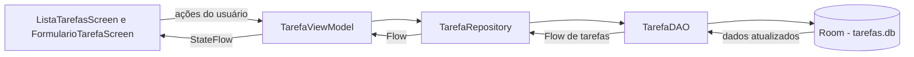

As funcionalidades de prazo e de confirmação respeitam essa mesma divisão:

- **Prazo:** o campo nasce na entidade, é ordenado no DAO, convertido por um utilitário e apenas exibido/editado pelas telas.
- **Confirmação de exclusão:** o diálogo é um estado temporário da interface. Ele fica inteiramente na camada Compose; a ViewModel só é acionada depois que o usuário confirma.

## Etapa 3 — confirmação de exclusão (Checkpoint 05)

O Checkpoint 05 pediu que a exclusão deixasse de ser imediata. A implementação ficou concentrada em um único arquivo, `ListaTarefasScreen.kt`, detalhado no tópico **7** da documentação do código:

| Antes | Depois |
|---|---|
| A lixeira chamava `onDeletar(tarefa)` diretamente. | A lixeira apenas guarda a tarefa em `tarefaParaExcluir`. |
| A tarefa sumia no mesmo toque. | Um `AlertDialog` pergunta se a tarefa deve ser excluída, exibindo seu título. |
| Não havia como desistir. | `Cancelar`, toque fora do diálogo ou botão Voltar fecham sem alterar a lista. |
| — | `Excluir` chama `onDeletar(tarefa)` e fecha o diálogo. |

ViewModel, Repository, DAO, banco e navegação permaneceram inalterados. A confirmação acontece sobre a própria lista, sem nova tela ou rota, e a nova preview `Confirmação de exclusão` demonstra esse estado. As evidências estão na seção **11** e em [EVIDENCIAS_EXCLUSAO.md](EVIDENCIAS_EXCLUSAO.md).

## Documentação do código

Esta seção segue o caminho percorrido pelos dados: começa na entidade persistida, passa pelo acesso ao banco e pela regra de estado, chega às telas e termina na inicialização do aplicativo, no tema, na configuração e nos testes.

### 1. [`Tarefa.kt`](app/src/main/java/lucasra/com/github/todolist/data/Tarefa.kt) — modelo de dados e entidade do Room

```kotlin
@Entity(tableName = "tarefas")
data class Tarefa(
    @PrimaryKey(autoGenerate = true) val id: Int = 0,
    val titulo: String,
    val descricao: String,
    val concluida: Boolean = false,
    val dataCriacao: Long = System.currentTimeMillis(),
    val dataHora: Long? = null
)
```

`Tarefa` é simultaneamente o modelo usado pelo Kotlin e a entidade persistida pelo Room. A anotação `@Entity(tableName = "tarefas")` informa que cada objeto corresponde a uma linha da tabela `tarefas`.

| Propriedade | Responsabilidade |
|---|---|
| `id` | Chave primária. O Room gera o valor automaticamente; por isso uma nova tarefa pode começar com `0`. |
| `titulo` | Texto principal e único campo obrigatório no formulário. |
| `descricao` | Informação complementar exibida abaixo do título. |
| `concluida` | Controla o checkbox e o efeito de texto tachado; novas tarefas começam como pendentes. |
| `dataCriacao` | Guarda o instante de criação e desempata a ordenação das tarefas. |
| `dataHora` | Prazo opcional em milissegundos. `null` representa uma tarefa avulsa, sem prazo. |

`dataHora` é do tipo `Long?` com valor padrão `null`. Assim, uma tarefa sem prazo pode ser criada sem informar esse campo, e o prazo é realmente opcional.

Por ser uma `data class`, `Tarefa` possui automaticamente recursos como comparação por conteúdo e a função `copy()`. A interface utiliza `copy()` para alterar somente uma propriedade sem perder as demais. Por exemplo, `tarefa.copy(concluida = true)` conserva ID, título, descrição, data de criação e prazo.

### 2. [`TarefaDAO.kt`](app/src/main/java/lucasra/com/github/todolist/data/TarefaDAO.kt) — comandos de acesso ao banco

```kotlin
@Dao
interface TarefaDAO {
    @Query("SELECT * FROM tarefas ORDER BY dataHora IS NULL, dataHora ASC, dataCriacao DESC")
    fun listarTodas(): Flow<List<Tarefa>>

    @Insert
    suspend fun inserir(tarefa: Tarefa)

    @Update
    suspend fun atualizar(tarefa: Tarefa)

    @Delete
    suspend fun deletar(tarefa: Tarefa)
}
```

DAO significa *Data Access Object*. Essa interface declara quais operações podem ser feitas no banco; a implementação concreta é gerada pelo Room durante a compilação.

A consulta de listagem ordena as tarefas em três critérios:

| Critério | Efeito |
|---|---|
| `dataHora IS NULL` | Vale `0` para tarefas com prazo e `1` para avulsas; por isso as tarefas com prazo vêm primeiro. |
| `dataHora ASC` | Entre as tarefas com prazo, o vencimento mais próximo aparece antes. |
| `dataCriacao DESC` | Entre as avulsas, a mais recente aparece antes. |

- `listarTodas()` retorna `Flow<List<Tarefa>>`. O `Flow` não entrega apenas uma fotografia dos dados: ele emite uma nova lista quando a tabela muda.
- `@Insert`, `@Update` e `@Delete` representam as operações de criar, atualizar e remover do CRUD.
- As três operações de escrita são `suspend`, porque acesso a banco pode levar tempo e não deve bloquear a thread principal da interface.

O DAO conhece Room e SQL, mas não conhece telas, navegação ou componentes Compose.

### 3. [`TarefaDatabase.kt`](app/src/main/java/lucasra/com/github/todolist/data/TarefaDatabase.kt) — criação e compartilhamento do banco

```kotlin
@Database(entities = [Tarefa::class], version = 2, exportSchema = false)
abstract class TarefaDatabase : RoomDatabase() {
    abstract fun tarefaDao(): TarefaDAO

    companion object {
        @Volatile
        private var INSTANCE: TarefaDatabase? = null

        fun getDatabase(context: Context): TarefaDatabase {
            return INSTANCE ?: synchronized(this) {
                Room.databaseBuilder(
                    context.applicationContext,
                    TarefaDatabase::class.java,
                    "tarefas.db"
                ).fallbackToDestructiveMigration(dropAllTables = true)
                    .build()
                    .also { INSTANCE = it }
            }
        }
    }
}
```

`@Database` registra `Tarefa` como entidade e define a versão do esquema. A função abstrata `tarefaDao()` dá acesso ao DAO que o Room gera.

Com a coluna `dataHora`, o esquema passou da versão `1` para a `2`. `fallbackToDestructiveMigration(dropAllTables = true)` instrui o Room a recriar o banco quando encontra uma versão antiga, em vez de encerrar o aplicativo por falta de migração. Em um projeto acadêmico isso é suficiente; em produção, seria escrita uma `Migration` para preservar os dados existentes.

O `companion object` implementa um Singleton:

1. `INSTANCE` guarda a instância já criada.
2. `@Volatile` faz as threads enxergarem o valor mais recente dessa variável.
3. `INSTANCE ?: synchronized(this)` só entra no bloco de criação quando ainda não existe banco.
4. `synchronized` evita que duas threads criem duas instâncias ao mesmo tempo.
5. `applicationContext` é utilizado para não manter uma referência desnecessária à `Activity`.
6. O banco físico recebe o nome `tarefas.db`.

Esse padrão permite reutilizar uma única conexão de banco durante a execução do aplicativo.

### 4. [`DataHoraUtil.kt`](app/src/main/java/lucasra/com/github/todolist/util/DataHoraUtil.kt) — conversões de data e hora

O banco guarda o prazo como um único número (`Long`), mas a interface trabalha com dia, mês, ano, hora e minuto separados. Este arquivo concentra as conversões entre esses formatos, deixando as telas mais simples.

```kotlin
fun formatarDataHora(millis: Long): String {
    val formato = SimpleDateFormat("dd/MM/yyyy 'às' HH:mm", Locale.forLanguageTag("pt-BR"))
    return formato.format(Date(millis))
}

fun combinarDataHora(ano: Int, mes: Int, dia: Int, hora: Int, minuto: Int): Long {
    val calendario = Calendar.getInstance()
    calendario.clear()
    calendario.set(ano, mes, dia, hora, minuto)
    return calendario.timeInMillis
}
```

| Função | Responsabilidade |
|---|---|
| `formatarDataHora(millis)` | Converte o timestamp para o texto exibido na lista, como `25/09/2026 às 14:30`. |
| `extrairDataDoDatePicker(millisUTC)` | Lê ano, mês e dia do valor devolvido pelo `DatePicker`. |
| `paraMillisUtcDoDatePicker(ano, mes, dia)` | Faz o caminho inverso, para abrir o seletor já na data escolhida. |
| `combinarDataHora(ano, mes, dia, hora, minuto)` | Junta data e horário em um timestamp no fuso do dispositivo, pronto para salvar. |

O ponto que merece atenção é o fuso horário. O `DatePicker` do Material 3 representa a data escolhida como a meia-noite daquele dia em **UTC**. Se esse valor fosse lido no fuso do Brasil (UTC−3), a data poderia voltar um dia. Por isso, `extrairDataDoDatePicker` e `paraMillisUtcDoDatePicker` usam `TimeZone.getTimeZone("UTC")`, enquanto `combinarDataHora` usa o fuso local, que é o horário real da tarefa.

As funções usam `Calendar` e `SimpleDateFormat`, disponíveis em todas as versões suportadas pelo `minSdk 24`.

### 5. [`TarefaRepository.kt`](app/src/main/java/lucasra/com/github/todolist/repository/TarefaRepository.kt) — separação entre dados e apresentação

```kotlin
class TarefaRepository(private val dao: TarefaDAO) {
    val tarefas: Flow<List<Tarefa>> = dao.listarTodas()

    suspend fun inserir(tarefa: Tarefa) = dao.inserir(tarefa)
    suspend fun atualizar(tarefa: Tarefa) = dao.atualizar(tarefa)
    suspend fun deletar(tarefa: Tarefa) = dao.deletar(tarefa)
}
```

O repositório recebe o DAO pelo construtor e oferece uma API de dados para o restante da aplicação. Sua responsabilidade é impedir que a ViewModel dependa diretamente dos detalhes do Room.

Neste projeto, o repositório é propositalmente simples:

- `tarefas` repassa o fluxo reativo produzido por `listarTodas()`;
- cada método `suspend` delega uma operação de escrita ao DAO;
- a ViewModel sabe que pode listar e alterar tarefas, mas não precisa conhecer anotações Room nem SQL.

Essa separação fica visível no projeto: a ordenação por prazo é resolvida inteiramente no DAO, sem exigir mudanças no repositório ou na ViewModel. Da mesma forma, a confirmação de exclusão é uma decisão de interface e não chega a esta camada.

### 6. [`TarefaViewModel.kt`](app/src/main/java/lucasra/com/github/todolist/viewmodel/TarefaViewModel.kt) — estado da interface e operações

```kotlin
val tarefas: StateFlow<List<Tarefa>> = repository.tarefas
    .stateIn(
        scope = viewModelScope,
        started = SharingStarted.WhileSubscribed(5_000),
        initialValue = emptyList()
    )
```

A ViewModel transforma o `Flow` do repositório em `StateFlow`, um tipo de fluxo que sempre possui um valor atual. Isso é útil para o Compose, que precisa saber qual lista deve desenhar a cada momento.

- `scope = viewModelScope` mantém a coleta vinculada ao ciclo de vida da ViewModel.
- `initialValue = emptyList()` oferece um estado inicial enquanto o Room ainda não emitiu os dados.
- `SharingStarted.WhileSubscribed(5_000)` mantém o fluxo ativo enquanto há telas observando e espera cinco segundos após o último observador antes de interrompê-lo. Essa tolerância evita reinícios desnecessários em mudanças rápidas de configuração.

As operações são executadas em corrotinas:

```kotlin
fun inserir(tarefa: Tarefa) =
    viewModelScope.launch { repository.inserir(tarefa) }

fun atualizar(tarefa: Tarefa) =
    viewModelScope.launch { repository.atualizar(tarefa) }

fun deletar(tarefa: Tarefa) =
    viewModelScope.launch { repository.deletar(tarefa) }
```

As telas chamam funções comuns, sem precisar iniciar corrotinas ou manipular o DAO. Quando a ViewModel é descartada, o `viewModelScope` cancela automaticamente os trabalhos associados.

A `factory(context)` resolve manualmente as dependências:

```kotlin
companion object {
    fun factory(context: Context): ViewModelProvider.Factory =
        object : ViewModelProvider.Factory {
            @Suppress("UNCHECKED_CAST")
            override fun <T : ViewModel> create(modelClass: Class<T>): T {
                val dao = TarefaDatabase.getDatabase(context).tarefaDao()
                return TarefaViewModel(TarefaRepository(dao)) as T
            }
        }
}
```

```text
Context → TarefaDatabase → TarefaDAO → TarefaRepository → TarefaViewModel
```

Ela é necessária porque `TarefaViewModel` possui um parâmetro no construtor. A criação padrão de ViewModels não saberia como montar o repositório sem essa instrução.

### 7. [`ListaTarefasScreen.kt`](app/src/main/java/lucasra/com/github/todolist/ui/ListaTarefasScreen.kt) — lista, prazo e confirmação de exclusão

O arquivo separa duas responsabilidades:

- `ListaTarefasScreen` conecta a interface à ViewModel;
- `ListaTarefasContent` recebe dados e callbacks, ficando mais fácil de visualizar em previews e de testar isoladamente.

A observação do estado acontece aqui:

```kotlin
val tarefas by viewModel.tarefas.collectAsStateWithLifecycle()
```

`collectAsStateWithLifecycle()` converte o `StateFlow` em estado do Compose e respeita o ciclo de vida da tela. Quando o Room emite uma lista diferente, o Compose agenda a recomposição dos componentes que leem `tarefas`.

As ações são convertidas em chamadas da ViewModel:

```kotlin
onCheckedChange = { tarefa, concluida ->
    viewModel.atualizar(tarefa.copy(concluida = concluida))
}
onDeletar = { tarefa -> viewModel.deletar(tarefa) }
```

Ao marcar o checkbox, `copy()` cria uma nova versão imutável do objeto com apenas `concluida` alterado. Essa nova tarefa percorre ViewModel, Repository e DAO até o Room. A emissão atualizada do banco retorna pelo fluxo e redesenha a tela.

#### Estrutura da lista

```kotlin
LazyColumn(
    modifier = Modifier
        .fillMaxSize()
        .padding(padding),
    contentPadding = PaddingValues(16.dp),
    verticalArrangement = Arrangement.spacedBy(8.dp)
) {
    items(tarefas, key = { it.id }) { tarefa ->
        TarefaItem(
            tarefa = tarefa,
            onCheckedChange = { concluida -> onCheckedChange(tarefa, concluida) },
            onEditar = { onEditarTarefa(tarefa.id) },
            onDeletar = { tarefaParaExcluir = tarefa }
        )
    }
}
```

- `Scaffold` organiza a barra superior `Minhas Tarefas` e o botão flutuante `+`;
- `LazyColumn` cria apenas os itens necessários para a área visível;
- `items(tarefas, key = { it.id })` usa o ID como identidade estável de cada item;
- se a lista estiver vazia, é exibido `Nenhuma tarefa cadastrada.`.

Cada item é desenhado por `TarefaItem`:

- o `Card` inteiro é clicável e abre a edição pelo ID;
- o `Checkbox` altera a conclusão;
- `TextDecoration.LineThrough` tacha o título quando a tarefa está concluída;
- `TextOverflow.Ellipsis` impede que uma descrição extensa ocupe várias linhas;
- o `IconButton` com lixeira abre a confirmação de exclusão.

#### Prazo e destaque de atraso

Dentro de `TarefaItem`, o prazo só é desenhado quando existe:

```kotlin
if (tarefa.dataHora != null){
    val atrasada = tarefa.dataHora < System.currentTimeMillis() && !tarefa.concluida
    Text(
        text = formatarDataHora(tarefa.dataHora),
        style = MaterialTheme.typography.bodySmall,
        color = if (atrasada) MaterialTheme.colorScheme.error else Color.Unspecified,
        fontWeight = if (atrasada) FontWeight.Bold else FontWeight.Normal
    )
}
```

- tarefas avulsas não exibem nenhuma linha de prazo;
- `atrasada` é verdadeira quando o prazo já passou **e** a tarefa ainda não foi concluída;
- o atraso usa `colorScheme.error`, a cor de erro do tema Material 3, em negrito;
- ao concluir uma tarefa vencida, o destaque desaparece, pois o atraso deixa de ser relevante.

#### Confirmação de exclusão

A exclusão acontece em duas etapas. Primeiro, `ListaTarefasContent` guarda qual tarefa aguarda confirmação:

```kotlin
var tarefaParaExcluir by remember { mutableStateOf<Tarefa?>(null) }
```

- `null` significa que não há diálogo aberto;
- um objeto `Tarefa` significa que o diálogo deve aparecer para aquela tarefa.

A lixeira de cada card apenas preenche esse estado (`onDeletar = { tarefaParaExcluir = tarefa }`). Enquanto houver uma tarefa guardada, o diálogo é exibido sobre a lista:

```kotlin
tarefaParaExcluir?.let { tarefa ->
    ConfirmacaoExclusaoDialog(
        tarefa = tarefa,
        onConfirmar = {
            onDeletar(tarefa)
            tarefaParaExcluir = null
        },
        onCancelar = { tarefaParaExcluir = null }
    )
}
```

O diálogo em si é um composable simples, baseado no `AlertDialog` do Material 3:

```kotlin
@Composable
private fun ConfirmacaoExclusaoDialog(
    tarefa: Tarefa,
    onConfirmar: () -> Unit,
    onCancelar: () -> Unit
) {
    AlertDialog(
        onDismissRequest = onCancelar,
        title = { Text("Excluir tarefa?") },
        text = { Text("Tem certeza de que deseja excluir a tarefa “${tarefa.titulo}”?") },
        confirmButton = {
            TextButton(onClick = onConfirmar) { Text("Excluir") }
        },
        dismissButton = {
            TextButton(onClick = onCancelar) { Text("Cancelar") }
        }
    )
}
```

| Ação do usuário | O que acontece |
|---|---|
| Toca na lixeira | `tarefaParaExcluir` recebe a tarefa; o diálogo abre e a lista não muda. |
| Toca em `Cancelar` | `tarefaParaExcluir = null`; o diálogo fecha e nada é excluído. |
| Toca fora do diálogo ou em Voltar | `onDismissRequest` chama o mesmo `onCancelar`, com o mesmo resultado. |
| Toca em `Excluir` | `onDeletar(tarefa)` aciona `viewModel.deletar(tarefa)` e o diálogo fecha. |

Pontos importantes da solução:

- **Somente a tarefa selecionada é excluída**, porque o diálogo recebe o objeto guardado no momento do toque na lixeira, e é esse mesmo objeto que segue para `onDeletar`.
- **O título aparece no diálogo** por meio de `tarefa.titulo`, lido desse mesmo objeto.
- **Nenhuma tela ou rota nova foi criada**: o `AlertDialog` é desenhado em uma janela sobreposta à própria lista.
- **A arquitetura foi mantida**: a pergunta "tem certeza?" é estado temporário da interface. Por isso fica em `remember` no Compose, e não na ViewModel ou no banco. A ViewModel só recebe o pedido de exclusão depois da confirmação.

#### Previews

O arquivo possui sete previews, todos com dados de exemplo e callbacks vazios, sem ViewModel, banco ou `Context`:

| Preview | O que mostra |
|---|---|
| `Lista com tarefas` | Lista com uma tarefa pendente e uma concluída. |
| `Lista vazia` | Mensagem `Nenhuma tarefa cadastrada.`. |
| `Item pendente` | Card com checkbox desmarcado. |
| `Item concluído` | Card com checkbox marcado e título tachado. |
| `Item com prazo futuro` | Prazo de amanhã, na cor normal. |
| `Item atrasado` | Prazo de ontem, em vermelho e negrito. |
| `Confirmação de exclusão` | Lista de exemplo com o diálogo de exclusão por cima. |

A preview da confirmação desenha a lista ao fundo e o diálogo com a tarefa `Estudar Room`:

```kotlin
@Preview(showBackground = true, name = "Confirmação de exclusão")
@Composable
private fun ConfirmacaoExclusaoDialogPreview(){
    val tarefa = Tarefa(id = 1, titulo = "Estudar Room", descricao = "Revisar anotações e DAO", concluida = false)
    ListaTarefasContent(
        tarefas = listOf(
            tarefa,
            Tarefa(id = 2, titulo = "Enviar atividade", descricao = "Upload no portal da FIAP", concluida = true)
        ),
        onNovaTarefa = {},
        onEditarTarefa = {},
        onCheckedChange = { _, _ -> },
        onDeletar = {}
    )
    ConfirmacaoExclusaoDialog(
        tarefa = tarefa,
        onConfirmar = {},
        onCancelar = {}
    )
}
```

A lista ao fundo tem um motivo prático: o `AlertDialog` é desenhado em uma janela separada e, sozinho, deixa a preview sem tamanho, aparecendo vazia no Android Studio. Com a lista como base, a preview mostra exatamente o estado da tela durante a confirmação.

### 8. [`FormularioTarefaScreen.kt`](app/src/main/java/lucasra/com/github/todolist/ui/FormularioTarefaScreen.kt) — cadastro, edição e prazo na mesma tela

A tela observa a mesma lista da ViewModel e procura a tarefa correspondente ao ID recebido:

```kotlin
val tarefas by viewModel.tarefas.collectAsStateWithLifecycle()
val tarefaExistente = remember(tarefas, tarefaId) {
    tarefas.find { it.id == tarefaId }
}
```

Como `tarefas` e `tarefaId` são chaves de `remember`, a busca é refeita quando a lista carregada pelo Room muda ou quando outro ID é recebido.

A regra que diferencia os modos é:

```kotlin
isEdicao = tarefaId != 0
```

- `tarefaId == 0`: cadastro de uma nova tarefa;
- `tarefaId != 0`: edição de uma tarefa existente.

No modo de edição, `tituloInicial`, `descricaoInicial` e `dataHoraInicial` recebem os dados do objeto localizado. No modo de cadastro, os textos começam vazios e o prazo começa como `null`.

#### Estado do formulário

Dentro de `FormularioTarefaContent`, `remember` e `mutableStateOf` guardam o texto digitado, se o prazo está ativado e cada parte da data/hora:

```kotlin
var titulo by remember(tituloInicial) { mutableStateOf(tituloInicial) }
var descricao by remember(descricaoInicial) { mutableStateOf(descricaoInicial) }
var temDataHora by remember(dataHoraInicial) { mutableStateOf(dataHoraInicial != null) }

var ano by remember(dataHoraInicial) { mutableStateOf(calendarioInicial?.get(Calendar.YEAR)) }
var mes by remember(dataHoraInicial) { mutableStateOf(calendarioInicial?.get(Calendar.MONTH)) }
var dia by remember(dataHoraInicial) { mutableStateOf(calendarioInicial?.get(Calendar.DAY_OF_MONTH)) }
var hora by remember(dataHoraInicial) { mutableStateOf(calendarioInicial?.get(Calendar.HOUR_OF_DAY)) }
var minuto by remember(dataHoraInicial) { mutableStateOf(calendarioInicial?.get(Calendar.MINUTE)) }
```

- ao editar uma tarefa com prazo, o `Switch` já começa ligado e os botões mostram a data e o horário salvos;
- valores `null` indicam que aquela parte ainda não foi escolhida, e o botão mostra `Selecionar data` ou `Selecionar hora`;
- `mostrarSeletorData` e `mostrarSeletorHora` controlam, também com `remember`, quando cada seletor aparece.

#### Seletores de data e hora

```kotlin
DatePickerDialog(
    onDismissRequest = { mostrarSeletorData = false },
    confirmButton = {
        TextButton(onClick = {
            estadoDatePicker.selectedDateMillis?.let { millisUtc ->
                val (a, m, d) = extrairDataDoDatePicker(millisUtc)
                ano = a
                mes = m
                dia = d
            }
            mostrarSeletorData = false
        }) { Text("OK") }
    },
    dismissButton = {
        TextButton(onClick = { mostrarSeletorData = false }) { Text("Cancelar") }
    }
) {
    DatePicker(state = estadoDatePicker)
}
```

- O `Switch` **Definir data e horário** mostra ou esconde os dois botões de prazo.
- O botão de data abre o `DatePickerDialog`. Ao confirmar, `extrairDataDoDatePicker` converte a data UTC em ano, mês e dia.
- O botão de hora abre um `TimePicker` em formato 24 horas (`is24Hour = true`) dentro de um `Dialog`, com botões `Cancelar` e `OK`.
- Os textos dos botões usam `String.format("%02d/%02d/%04d", ...)` e `String.format("%02d:%02d", ...)`. O mês recebe `+ 1` porque, em `Calendar`, janeiro é `0`.

#### Salvamento

O botão **Salvar** monta o prazo apenas se o `Switch` estiver ligado:

```kotlin
val dataHora = if (temDataHora) {
    combinarDataHora(ano!!, mes!!, dia!!, hora!!, minuto!!)
} else {
    null
}
onSalvar(titulo.trim(), descricao.trim(), dataHora)
```

E só fica habilitado quando os dados estão completos:

```kotlin
enabled = titulo.isNotBlank() && (!temDataHora || (ano != null && hora != null))
```

Ou seja: o título é sempre obrigatório e, se o prazo estiver ativado, data e hora também precisam ter sido escolhidas. O botão fica fora do bloco `if (temDataHora)`, por isso aparece também para tarefas sem prazo.

Na tela stateful, o fluxo se divide:

```kotlin
if (tarefaId == 0) {
    viewModel.inserir(Tarefa(titulo = titulo, descricao = descricao, dataHora = dataHora))
} else {
    tarefaExistente?.let {
        viewModel.atualizar(it.copy(titulo = titulo, descricao = descricao, dataHora = dataHora))
    }
}
onVoltar()
```

No cadastro, um novo objeto é criado com ID automático, `concluida = false`, data de criação atual e o prazo escolhido. Na edição, `copy()` preserva ID, conclusão e data de criação, substituindo título, descrição e prazo. Desligar o `Switch` e salvar remove o prazo da tarefa, que volta a ser avulsa. Depois da operação, `onVoltar()` retorna à lista.

O conteúdo do formulário também:

- alterna o título da barra entre `Nova Tarefa` e `Editar Tarefa`;
- remove espaços nas extremidades com `trim()` antes de salvar;
- usa uma seta de retorno com descrição de acessibilidade `Voltar`;
- possui previews para nova tarefa, edição de tarefa avulsa e edição de tarefa com data/hora.

### 9. [`AppNavigation.kt`](app/src/main/java/lucasra/com/github/todolist/navigation/AppNavigation.kt) — rotas e passagem do ID

```kotlin
val navController = rememberNavController()

NavHost(navController = navController, startDestination = "lista") {
    composable("lista") { /* tela de listagem */ }
    composable("formulario/{tarefaId}") { /* formulário */ }
}
```

`rememberNavController()` mantém o controlador responsável pela pilha de telas. O `NavHost` declara `lista` como destino inicial e registra duas rotas:

| Rota | Valor do ID | Resultado |
|---|---:|---|
| `lista` | Não se aplica | Exibe as tarefas e, quando necessário, o diálogo de confirmação. |
| `formulario/0` | `0` | Abre um cadastro vazio. |
| `formulario/<id>` | ID real | Abre a edição da tarefa correspondente. |

A confirmação de exclusão não possui rota própria: ela acontece dentro da rota `lista`.

Os callbacks recebidos pela lista não conhecem o `NavController`; quem traduz eventos em navegação é `AppNavigation`:

```kotlin
onNovaTarefa = { navController.navigate("formulario/0") }
onEditarTarefa = { id -> navController.navigate("formulario/$id") }
```

Na rota do formulário, o argumento é lido como texto, convertido para inteiro e repassado à tela:

```kotlin
val tarefaId = backStackEntry.arguments
    ?.getString("tarefaId")
    ?.toInt() ?: 0
```

Para voltar, o formulário chama um callback que executa `navController.popBackStack()`. Isso remove a tela atual da pilha e revela novamente a lista, sem recriar ou encerrar o aplicativo.

### 10. [`MainActivity.kt`](app/src/main/java/lucasra/com/github/todolist/MainActivity.kt) — ponto de entrada da aplicação

```kotlin
setContent {
    TodolistTheme {
        val viewModel: TarefaViewModel = viewModel(
            factory = TarefaViewModel.factory(applicationContext)
        )
        AppNavigation(viewModel = viewModel)
    }
}
```

`MainActivity` herda de `ComponentActivity` e é a Activity marcada como inicial no manifesto. Em `onCreate()`:

1. `enableEdgeToEdge()` permite que o conteúdo utilize a área disponível junto às barras do sistema.
2. `setContent` inicia a árvore de componentes Jetpack Compose.
3. `TodolistTheme` aplica cores e tipografia do projeto.
4. `viewModel(factory = ...)` cria ou recupera a `TarefaViewModel` associada à Activity.
5. `applicationContext` é entregue à Factory para obter o banco sem reter a Activity.
6. `AppNavigation(viewModel)` inicia a navegação e compartilha a mesma ViewModel entre lista e formulário.

Assim, a Activity funciona como ponto de composição das dependências e não concentra regras de cadastro, edição ou persistência.

### 11. [`ui/theme`](app/src/main/java/lucasra/com/github/todolist/ui/theme) — tema Material 3

```kotlin
@Composable
fun TodolistTheme(
    darkTheme: Boolean = isSystemInDarkTheme(),
    dynamicColor: Boolean = true,
    content: @Composable () -> Unit
) {
    val colorScheme = when {
        dynamicColor && Build.VERSION.SDK_INT >= Build.VERSION_CODES.S -> {
            val context = LocalContext.current
            if (darkTheme) dynamicDarkColorScheme(context) else dynamicLightColorScheme(context)
        }
        darkTheme -> DarkColorScheme
        else -> LightColorScheme
    }

    MaterialTheme(colorScheme = colorScheme, typography = Typography, content = content)
}
```

| Arquivo | Responsabilidade |
|---|---|
| `Color.kt` | Define as cores base (`Purple80`, `PurpleGrey80`, `Pink80`, `Purple40`, `PurpleGrey40`, `Pink40`). |
| `Type.kt` | Define a `Typography` usada pelos textos do Material 3. |
| `Theme.kt` | Escolhe o esquema de cores e aplica o `MaterialTheme`. |

- No Android 12 (API 31) ou superior, o tema usa **cores dinâmicas**, extraídas do papel de parede do dispositivo.
- Em versões anteriores, usa os esquemas `LightColorScheme` ou `DarkColorScheme`, conforme o modo escuro do sistema.
- Componentes como o destaque de atraso usam `MaterialTheme.colorScheme.error`, então se adaptam automaticamente ao tema ativo.

### 12. Configuração — [`build.gradle.kts`](app/build.gradle.kts) e [`AndroidManifest.xml`](app/src/main/AndroidManifest.xml)

O `build.gradle.kts` do módulo `app` define a identificação e as dependências do aplicativo:

```kotlin
android {
    namespace = "lucasra.com.github.todolist"
    defaultConfig {
        applicationId = "lucasra.com.github.todolist"
        minSdk = 24
        targetSdk = 37
    }
    buildFeatures {
        compose = true
    }
}
```

| Configuração | Finalidade |
|---|---|
| Plugins `android.application`, `kotlin.compose` e `ksp` | Aplicativo Android, compilador do Compose e geração de código do Room. |
| `compileSdk` e `targetSdk` 37, `minSdk` 24 | SDK usado na compilação e versão mínima do Android suportada. |
| `jvmToolchain(11)` | Compila o código com Java 11. |
| `compose-bom`, `material3`, `material-icons-core` | Interface em Compose, componentes Material 3 e ícones `Add` e `Delete`. |
| `lifecycle-viewmodel-compose` e `lifecycle-runtime-compose` | `viewModel()` e `collectAsStateWithLifecycle()`. |
| `navigation-compose` | Rotas entre lista e formulário. |
| `room-runtime`, `room-ktx` e `ksp(room-compiler)` | Banco local, suporte a corrotinas/Flow e geração do DAO. |
| `androidx-junit`, `kotlinx-coroutines-test` | Execução dos testes instrumentados com corrotinas. |

As versões ficam centralizadas no catálogo `gradle/libs.versions.toml`.

O `AndroidManifest.xml` registra a `MainActivity` com `action.MAIN` e `category.LAUNCHER`, tornando-a a tela aberta pelo ícone do aplicativo. `windowSoftInputMode="adjustResize"` faz a tela se ajustar quando o teclado aparece no formulário.

### 13. Testes — [`TarefaDAOTest.kt`](app/src/androidTest/java/lucasra/com/github/todolist/data/TarefaDAOTest.kt) e [`DataHoraUtilTest.kt`](app/src/androidTest/java/lucasra/com/github/todolist/data/DataHoraUtilTest.kt)

**`TarefaDAOTest`** cria um banco Room em memória antes de cada teste e o fecha ao final:

```kotlin
@Test
fun tarefasComPrazoAparecemAntesDeAvulsasEOrdenadasPorProximidade() = runTest {
    // insere uma tarefa avulsa e duas com prazo (distante e próximo)
    val tarefas = dao.listarTodas().first()

    assertEquals("Prazo proximo", tarefas[0].titulo)
    assertEquals("Prazo distante", tarefas[1].titulo)
    assertEquals("Avulsa", tarefas[2].titulo)
}
```

| Teste | O que verifica |
|---|---|
| `inserirTarefaEListar` | Insere uma tarefa e confirma quantidade, título e estado de conclusão. |
| `tarefasComPrazoAparecemAntesDeAvulsasEOrdenadasPorProximidade` | Confirma a ordem: prazo próximo, prazo distante e avulsa. |

O uso de um banco em memória torna o teste isolado: ele não lê nem altera as tarefas reais do usuário.

**`DataHoraUtilTest`** valida as funções de conversão:

| Teste | O que verifica |
|---|---|
| `formatarDataHoraRetornaTextoNoFormatoBrasileiro` | 15/07/2026 14:30 é exibido como `15/07/2026 às 14:30`. |
| `extrairDataDoDatePickerLeAnoMesDiaEmUtc` | A data UTC do seletor é lida sem voltar um dia. |
| `paraMillisUtcDoDatePickerEExtrairDataDoDatePickerSaoInversas` | Converter e desconverter devolve a mesma data. |
| `combinarDataHoraGeraTimestampComComponentesCorretos` | Data e hora combinadas geram o instante esperado. |

O projeto mantém ainda os testes de exemplo criados pelo Android Studio: `ExampleInstrumentedTest`, que confirma o pacote `lucasra.com.github.todolist`, e `ExampleUnitTest`, em `app/src/test`.

Os testes de `androidTest` são executados em emulador ou dispositivo Android. Na última execução, os **7 testes instrumentados** do projeto passaram.

## Fluxos completos da aplicação

### Cadastro

1. O usuário toca no botão `+` da lista.
2. `AppNavigation` navega para `formulario/0`.
3. O formulário identifica o ID `0` e entra no modo de cadastro.
4. Opcionalmente, liga **Definir data e horário** e escolhe a data e a hora.
5. Ao salvar, cria uma nova `Tarefa` (com `dataHora` ou `null`) e chama `TarefaViewModel.inserir()`.
6. A ViewModel inicia uma corrotina e chama o Repository.
7. O Repository delega ao DAO, que insere a linha no Room.
8. O Room emite uma nova lista, já ordenada por prazo, pelo `Flow`.
9. O `StateFlow` da ViewModel é atualizado e a `ListaTarefasScreen` recompõe.

### Edição

1. O usuário toca no card de uma tarefa.
2. A lista envia o ID para `AppNavigation`.
3. A rota `formulario/<id>` abre o formulário.
4. A tela localiza a tarefa no estado e preenche os campos, inclusive o prazo.
5. Ao salvar, `copy()` cria a versão com os textos e o prazo atualizados.
6. ViewModel, Repository e DAO executam o `UPDATE`.
7. A emissão do Room atualiza automaticamente a lista e sua ordem.

### Conclusão ou reabertura

1. O usuário altera o checkbox.
2. A lista cria `tarefa.copy(concluida = novoValor)`.
3. A ViewModel atualiza o registro no banco.
4. A nova emissão redesenha checkbox e título; o tachado aparece ou desaparece e, em tarefas vencidas, o destaque de atraso some ou volta.

### Exclusão com confirmação

1. O usuário toca no ícone de lixeira de uma tarefa.
2. `tarefaParaExcluir` recebe essa tarefa e o `AlertDialog` abre sobre a lista, com o título dela.
3. **Se tocar em `Cancelar`, fora do diálogo ou em Voltar:** `tarefaParaExcluir` volta a `null`, o diálogo fecha e a lista permanece igual.
4. **Se tocar em `Excluir`:** `onDeletar(tarefa)` chama `TarefaViewModel.deletar(tarefa)` e o diálogo fecha.
5. O DAO remove somente aquela linha do banco.
6. O `Flow` emite a lista sem o registro, e o Compose remove o card da interface.

## Conceitos aplicados

| Conceito | Aplicação neste projeto |
|---|---|
| Arquitetura em camadas | UI, ViewModel, Repository e Room possuem responsabilidades separadas. |
| Fluxo unidirecional | Estado desce da ViewModel para a UI; eventos sobem da UI para a ViewModel. |
| Reatividade | O Room emite `Flow`; a ViewModel expõe `StateFlow`; o Compose recompõe ao receber mudanças. |
| Imutabilidade | Alterações usam `copy()` para produzir uma nova versão de `Tarefa`. |
| Corrotinas | Escritas no banco são `suspend` e executadas no `viewModelScope`. |
| State hoisting | Composables de conteúdo recebem valores e callbacks, sem buscar dependências diretamente. |
| Estado local de interface | `remember` e `mutableStateOf` guardam textos do formulário, seletores abertos e a tarefa aguardando confirmação. |
| Estado nulo como controle | `tarefaParaExcluir == null` fecha o diálogo; um valor não nulo o abre para aquela tarefa. |
| Diálogos no Compose | `AlertDialog`, `DatePickerDialog` e `Dialog` aparecem sobre a tela sem criar novas rotas. |
| Ordenação no banco | `ORDER BY dataHora IS NULL, dataHora ASC, dataCriacao DESC` organiza a lista direto no SQL. |
| Timestamp e fuso horário | O prazo é salvo em milissegundos; o `DatePicker` trabalha em UTC e a conversão evita erro de um dia. |
| Versão do banco | A coluna `dataHora` exigiu `version = 2` e uma estratégia de migração. |
| Ciclo de vida | `collectAsStateWithLifecycle()` evita coleta desnecessária quando a tela não está ativa. |
| Injeção manual de dependências | A Factory monta Database, DAO, Repository e ViewModel. |
| Navegação parametrizada | O ID presente na rota define se o formulário cadastra ou edita. |

## Estrutura principal do projeto

```text
todolist/
├── EVIDENCIAS_EXCLUSAO.md
├── docs/images/
│   ├── prazo/                  → prints da funcionalidade de prazo
│   └── exclusao/               → prints da confirmação de exclusão
├── gradle/libs.versions.toml   → versões das dependências
└── app/
    ├── build.gradle.kts
    └── src/
        ├── main/
        │   ├── AndroidManifest.xml
        │   └── java/lucasra/com/github/todolist/
        │       ├── MainActivity.kt
        │       ├── data/
        │       │   ├── Tarefa.kt
        │       │   ├── TarefaDAO.kt
        │       │   └── TarefaDatabase.kt
        │       ├── repository/
        │       │   └── TarefaRepository.kt
        │       ├── viewmodel/
        │       │   └── TarefaViewModel.kt
        │       ├── navigation/
        │       │   └── AppNavigation.kt
        │       ├── util/
        │       │   └── DataHoraUtil.kt
        │       ├── ui/
        │       │   ├── ListaTarefasScreen.kt
        │       │   ├── FormularioTarefaScreen.kt
        │       │   └── theme/
        │       │       ├── Color.kt
        │       │       ├── Theme.kt
        │       │       └── Type.kt
        │       └── docs/evidencias/    → prints da primeira etapa
        ├── androidTest/java/lucasra/com/github/todolist/
        │   ├── ExampleInstrumentedTest.kt
        │   └── data/
        │       ├── TarefaDAOTest.kt
        │       └── DataHoraUtilTest.kt
        └── test/java/lucasra/com/github/todolist/
            └── ExampleUnitTest.kt
```

## Como executar

### Pré-requisitos

- Android Studio com suporte ao projeto configurado.
- Android SDK 37 instalado.
- JDK compatível com o Gradle do projeto; o código é compilado com toolchain Java 11.
- Emulador ou dispositivo Android com API 24 ou superior.

### Pelo Android Studio

1. Clone este repositório ou baixe e extraia o ZIP.
2. Abra a pasta raiz `todolist` no Android Studio.
3. Aguarde a sincronização do Gradle e o download das dependências.
4. Selecione um emulador ou dispositivo físico.
5. Execute a configuração `app` pelo botão **Run**.

> Se o aplicativo já estava instalado com a versão anterior do banco, as tarefas antigas são apagadas na primeira abertura, por causa da atualização para a versão 2 com `fallbackToDestructiveMigration`.

### Pelo terminal

No Windows:

```powershell
.\gradlew.bat assembleDebug
```

No Linux ou macOS:

```bash
./gradlew assembleDebug
```

O APK de depuração é gerado em `app/build/outputs/apk/debug/app-debug.apk`.

Para executar os testes instrumentados, mantenha um emulador ou dispositivo conectado e use:

```powershell
.\gradlew.bat connectedDebugAndroidTest
```

## Evidências da implementação

As imagens abaixo registram os fluxos obrigatórios solicitados na atividade. Os prints de uma mesma funcionalidade devem ser lidos em sequência quando indicado. As seções 1 a 9 são da primeira etapa; as seções 10 e 11 registram o prazo com data/hora e a confirmação de exclusão.

### 1. Tela inicial com a lista de tarefas

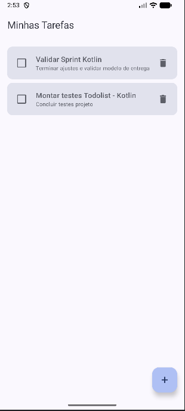

**Descrição:** tela inicial `Minhas Tarefas` em execução, com duas tarefas persistidas. Cada item apresenta caixa de conclusão, título, descrição e ação de exclusão; o botão flutuante `+` inicia um novo cadastro.

### 2. Cadastro de uma nova tarefa

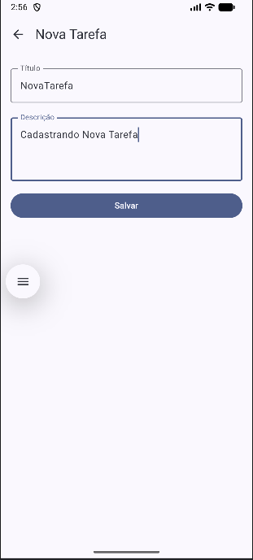

**Descrição:** formulário no modo `Nova Tarefa`, preenchido com o título `NovaTarefa` e a descrição `Cadastrando Nova Tarefa`. O botão `Salvar` está habilitado porque o título obrigatório foi informado.

### 3. Tarefa cadastrada aparecendo na lista

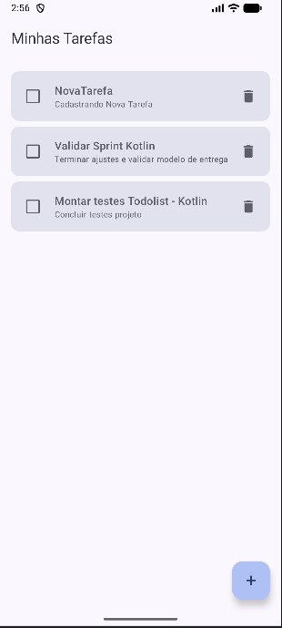

**Descrição:** após o salvamento, o aplicativo retorna à lista e exibe `NovaTarefa` como primeiro item. A posição confirma a ordenação das tarefas mais recentes pela data de criação, critério que continua valendo entre as tarefas avulsas.

### 4. Edição de uma tarefa existente

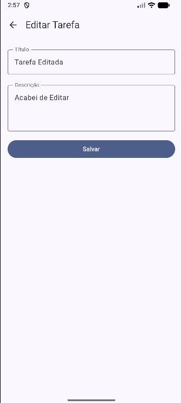

**Descrição:** formulário aberto no modo `Editar Tarefa`, com os campos preenchidos para alterar o registro para o título `Tarefa Editada` e a descrição `Acabei de Editar`.

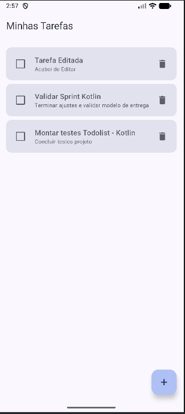

**Descrição:** retorno à lista após salvar a edição. O primeiro card já apresenta os novos valores, demonstrando que a atualização foi persistida e refletida na interface.

### 5. Tarefa marcada como concluída

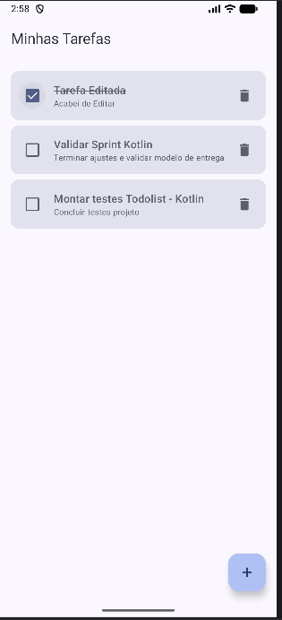

**Descrição:** a tarefa `Tarefa Editada` aparece com o checkbox selecionado e o título tachado. Esses dois elementos visuais refletem o valor `concluida = true` armazenado para o registro.

### 6. Exclusão de tarefas

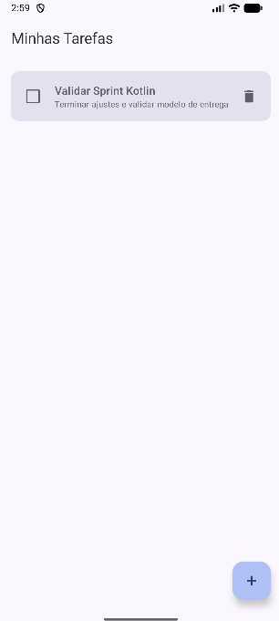

**Descrição:** estado da lista depois da exclusão de duas tarefas, ainda na primeira etapa, quando a lixeira excluía imediatamente. Em comparação com os prints anteriores, que exibem três registros, somente `Validar Sprint Kotlin` permanece. O fluxo atual, com confirmação, está na seção **11**.

### 7. Navegação da lista para o formulário

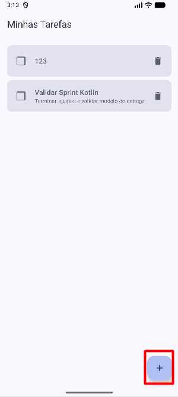

**Descrição:** tela da lista com o botão flutuante `+` destacado. Esse botão aciona a rota `formulario/0`, utilizada para iniciar um novo cadastro.

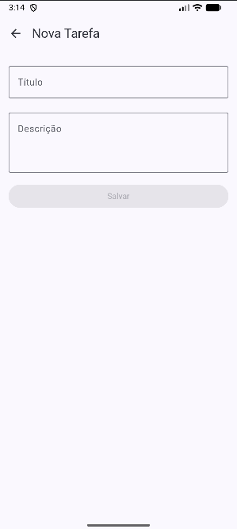

**Descrição:** formulário vazio exibido após a navegação. O título `Nova Tarefa` confirma o modo de cadastro; o botão `Salvar` permanece desabilitado enquanto o título não é preenchido.

### 8. Navegação do formulário para a lista

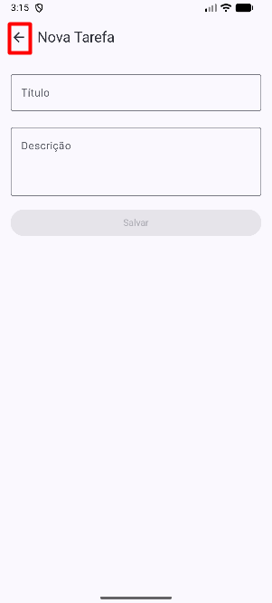

**Descrição:** seta de retorno destacada no formulário. A ação executa `popBackStack()` e volta à tela de lista sem encerrar o aplicativo.

### 9. Build do projeto sem erros

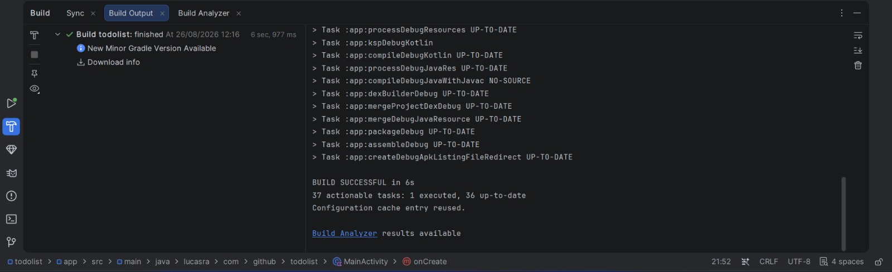

**Descrição:** painel **Build Output** do Android Studio com a mensagem `BUILD SUCCESSFUL`, confirmando a montagem do aplicativo sem erros. A versão atual também foi verificada com `gradlew.bat assembleDebug` e `connectedDebugAndroidTest`, ambos concluídos com sucesso.

### 10. Prazo com data e horário

#### 10.1. Formulário com prazo definido

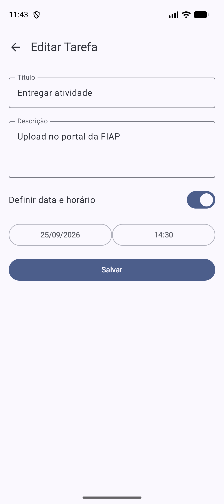

**Descrição:** tarefa `Entregar atividade` aberta no modo `Editar Tarefa`. O `Switch` **Definir data e horário** está ligado e os botões exibem o prazo salvo, `25/09/2026` e `14:30`, demonstrando que o prazo é carregado de volta ao editar.

#### 10.2. Seletor de data

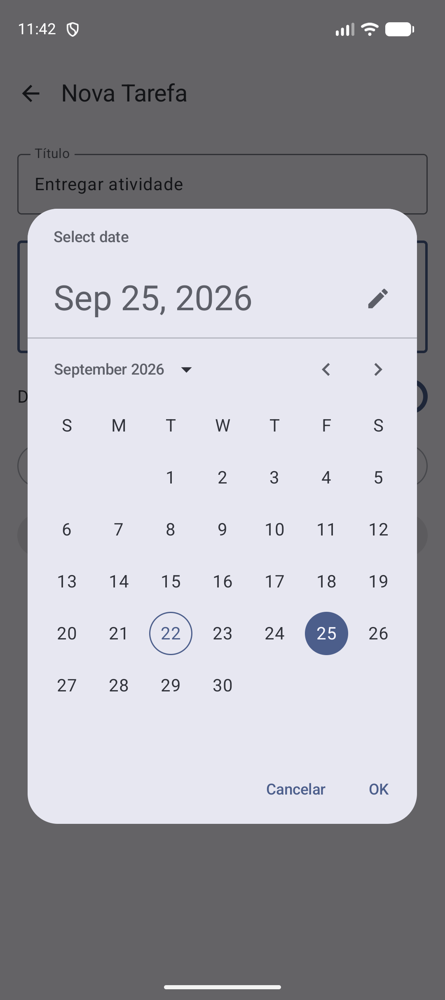

**Descrição:** `DatePickerDialog` do Material 3 aberto a partir do formulário, com o dia 25 de setembro de 2026 selecionado e as ações `Cancelar` e `OK`.

#### 10.3. Seletor de hora

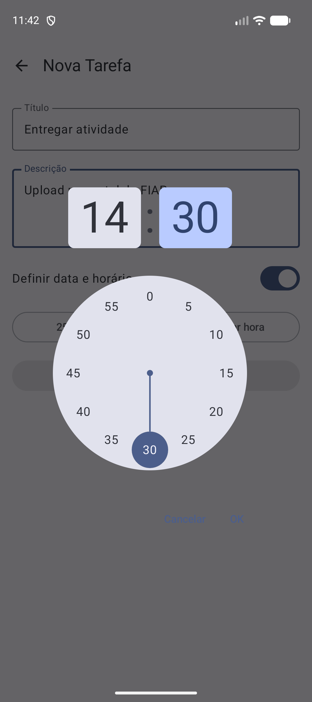

**Descrição:** `TimePicker` em formato 24 horas com o horário `14:30` escolhido, exibido em um `Dialog` sobre o formulário.

#### 10.4. Lista ordenada por prazo com destaque de atraso

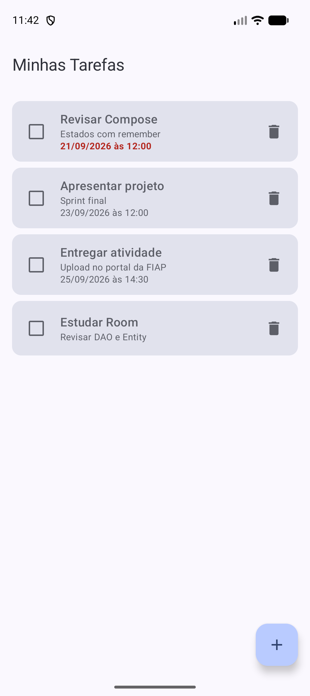

**Descrição:** a lista mostra primeiro as tarefas com prazo, da mais próxima para a mais distante (`21/09`, `23/09` e `25/09`), e por último a tarefa avulsa `Estudar Room`, sem linha de prazo. O prazo de `Revisar Compose` já venceu e, como a tarefa está pendente, aparece em vermelho e negrito.

### 11. Confirmação de exclusão

Sequência registrada no emulador para a tarefa **`Enviar atividade`**. O mesmo conteúdo está documentado em [EVIDENCIAS_EXCLUSAO.md](EVIDENCIAS_EXCLUSAO.md).

#### 11.1. Lista antes da exclusão

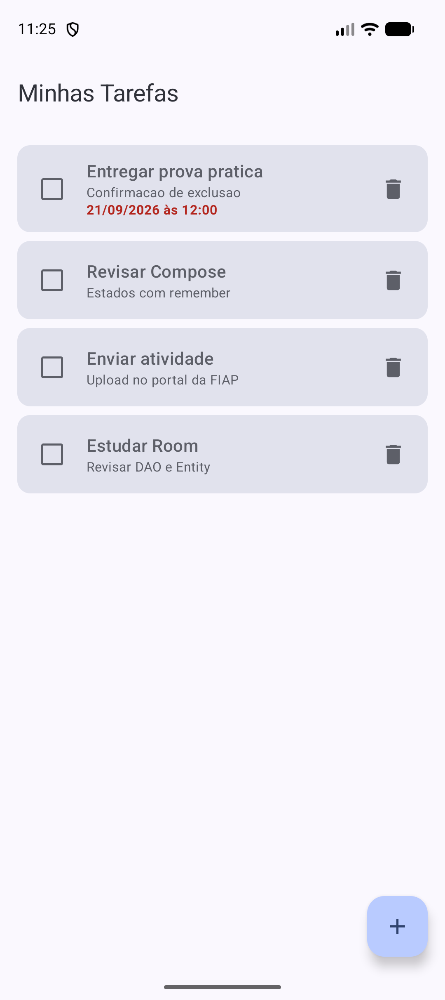

**Descrição:** lista com quatro tarefas: `Entregar prova pratica` (prazo vencido em destaque), `Revisar Compose`, `Enviar atividade` e `Estudar Room`.

#### 11.2. Diálogo aberto com a tarefa selecionada

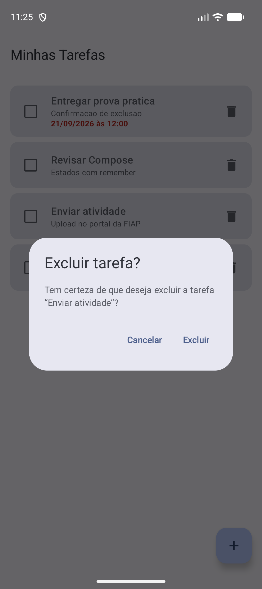

**Descrição:** ao tocar na lixeira de `Enviar atividade`, a tarefa não é excluída. O diálogo `Excluir tarefa?` abre sobre a própria lista e exibe o título da tarefa, com as ações `Cancelar` e `Excluir`.

#### 11.3. Resultado ao cancelar

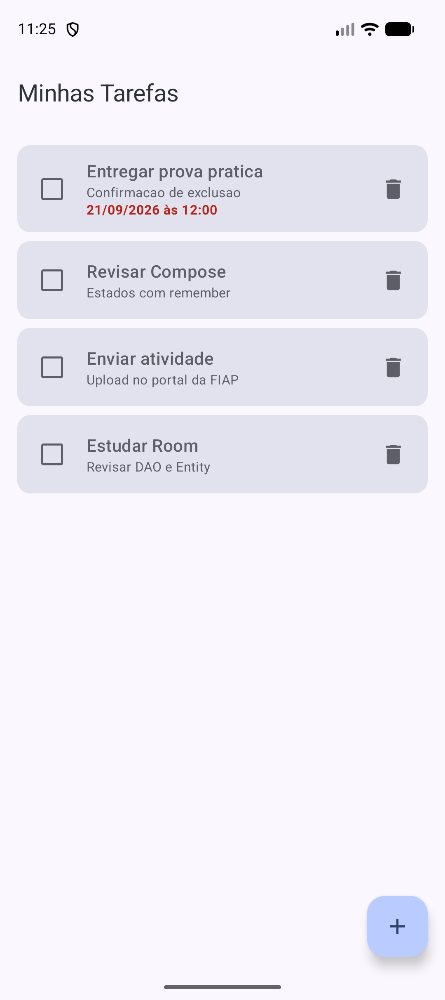

**Descrição:** após tocar em `Cancelar`, o diálogo fecha e **`Enviar atividade` permanece na lista**. As quatro tarefas continuam iguais.

#### 11.4. Nova abertura do diálogo

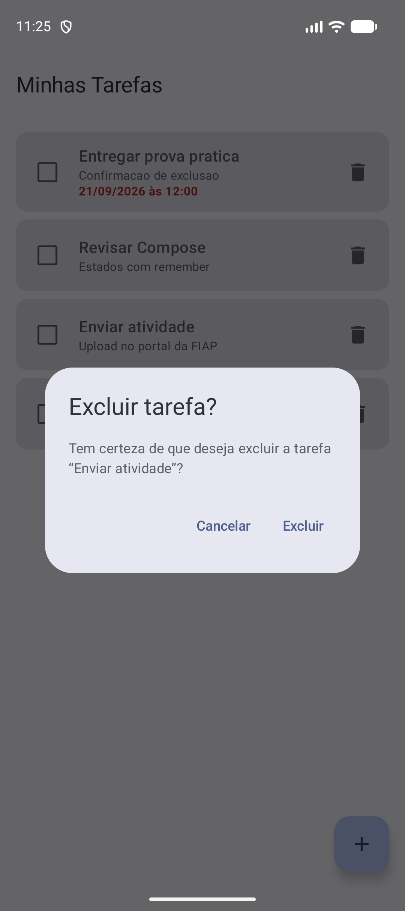

**Descrição:** a lixeira da mesma tarefa é tocada novamente e o diálogo reabre com o título `Enviar atividade`.

#### 11.5. Resultado após confirmar a exclusão

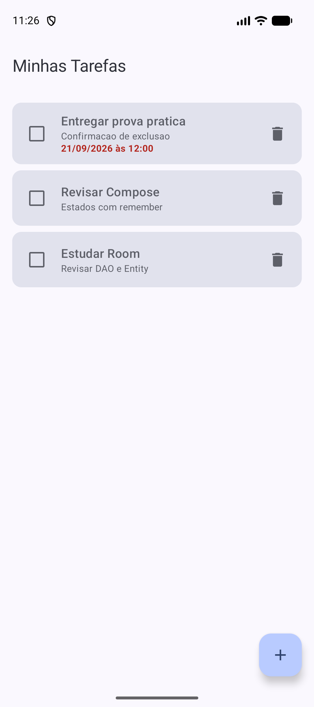

**Descrição:** após tocar em `Excluir`, o diálogo fecha e **somente `Enviar atividade` foi removida**. As outras três tarefas permanecem, com prazo, destaque de atraso e ordenação preservados.

## Checklist funcional

| Funcionalidade | Situação | Evidência |
|---|:---:|---|
| Listagem de tarefas | ✅ | Evidência 1 |
| Cadastro com título obrigatório | ✅ | Evidências 2, 3 e 7 |
| Edição de tarefa existente | ✅ | Evidência 4 |
| Conclusão e reabertura | ✅ | Evidência 5 |
| Navegação entre lista e formulário | ✅ | Evidências 7 e 8 |
| Prazo opcional por data e horário | ✅ | Evidências 10.1 a 10.3 |
| Tarefas com prazo antes das avulsas, ordenadas por proximidade | ✅ | Evidência 10.4 e teste do DAO |
| Destaque de tarefa atrasada | ✅ | Evidência 10.4 |
| Diálogo de confirmação ao tocar na lixeira | ✅ | Evidências 11.2 e 11.4 |
| `Cancelar` fecha sem alterar a lista | ✅ | Evidência 11.3 |
| `Excluir` remove somente a tarefa selecionada | ✅ | Evidência 11.5 |
| Preview do estado de confirmação | ✅ | Preview `Confirmação de exclusão` |
| Persistência com Room | ✅ | Dados mantidos após reiniciar o app |
| Build e testes instrumentados | ✅ | Evidência 9 (`assembleDebug` e 7 testes aprovados) |
