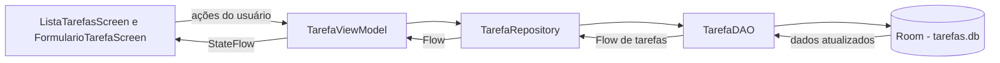

# To-Do List Android

Aplicativo Android de gerenciamento de tarefas desenvolvido como atividade individual da FIAP. A aplicação permite listar, cadastrar, editar, concluir, desmarcar e excluir tarefas, mantendo os dados no dispositivo por meio do Room.

O projeto integra uma interface declarativa com Jetpack Compose a uma arquitetura em camadas formada por `ViewModel`, `Repository`, DAO e banco de dados local. A navegação entre a lista e o formulário é realizada com Navigation Compose.

[Acessar o repositório no GitHub](https://github.com/Lucas-RA/todolist)

## Sumário

- [Funcionalidades](#funcionalidades)
- [Cobertura do enunciado](#cobertura-do-enunciado)
- [Tecnologias utilizadas](#tecnologias-utilizadas)
- [Arquitetura e fluxo de dados](#arquitetura-e-fluxo-de-dados)
- [Guia de estudo do código](#guia-de-estudo-código-explicado-arquivo-por-arquivo)
- [Fluxos completos da aplicação](#fluxos-completos-da-aplicação)
- [Conceitos importantes](#conceitos-importantes-para-estudar)
- [Estrutura do projeto](#estrutura-principal-do-projeto)
- [Como executar](#como-executar)
- [Evidências](#evidências-da-implementação)
- [Checklist funcional](#checklist-funcional)

## Funcionalidades

- Exibição das tarefas em uma `LazyColumn`.
- Cadastro de tarefas com título obrigatório e descrição opcional.
- Edição de uma tarefa existente ao tocar no respectivo card.
- Marcação e desmarcação de tarefas como concluídas.
- Destaque visual de tarefa concluída com título tachado.
- Exclusão de tarefas pelo ícone de lixeira.
- Navegação entre a lista e o formulário sem encerrar o aplicativo.
- Persistência local das informações com Room.
- Atualização reativa da interface por meio de `Flow` e `StateFlow`.

## Cobertura do enunciado

Todos os itens obrigatórios solicitados para o README estão contemplados:

| Item solicitado | Onde está explicado |
|---|---|
| Descrição e objetivo da aplicação | Introdução e seção **Funcionalidades**. |
| Kotlin, Compose, Room, Coroutines/Flow, ViewModel e Navigation Compose | Seção **Tecnologias utilizadas**. |
| Responsabilidade de `TarefaRepository` | Guia de estudo, tópico **4. TarefaRepository.kt**. |
| Responsabilidade de `TarefaViewModel` | Guia de estudo, tópico **5. TarefaViewModel.kt**. |
| Observação do estado e ações da `ListaTarefasScreen` | Guia de estudo, tópico **6. ListaTarefasScreen.kt**. |
| Diferença entre cadastro e edição no formulário | Guia de estudo, tópico **7. FormularioTarefaScreen.kt**. |
| Rotas e passagem do ID | Guia de estudo, tópico **8. AppNavigation.kt**. |
| Criação da ViewModel e início da navegação | Guia de estudo, tópico **9. MainActivity.kt**. |
| Instruções de execução | Seção **Como executar**. |
| Prints e descrições das evidências | Seção **Evidências da implementação**. |

## Tecnologias utilizadas

| Tecnologia | Uso no projeto |
|---|---|
| Kotlin | Linguagem principal do aplicativo. |
| Jetpack Compose e Material 3 | Construção declarativa das telas e dos componentes visuais. |
| Room | Persistência local das tarefas em um banco SQLite. |
| Coroutines e Flow | Execução assíncrona das operações e observação reativa dos dados. |
| ViewModel | Manutenção do estado da interface e execução das ações da aplicação. |
| Navigation Compose | Definição das rotas e navegação entre lista e formulário. |
| KSP | Processamento das anotações utilizadas pelo Room. |

Versões principais configuradas no projeto: Kotlin `2.2.10`, Room `2.7.1`, Navigation Compose `2.9.0`, Compose BOM `2026.02.01`, Android Gradle Plugin `9.3.1` e Gradle `9.5.0`.

## Arquitetura e fluxo de dados

O projeto separa a apresentação, o estado e o acesso aos dados. As telas enviam ações para a `TarefaViewModel`; a ViewModel delega as operações ao `TarefaRepository`; o repositório utiliza o `TarefaDAO`; e o DAO persiste as entidades no banco Room. No caminho inverso, o Room emite a lista atualizada como `Flow`, que chega à interface como `StateFlow` observável.



## Guia de estudo: código explicado arquivo por arquivo

Esta seção segue o caminho percorrido pelos dados: começa na entidade persistida, passa pelo acesso ao banco e pela regra de estado, chega às telas e termina na inicialização do aplicativo.

### 1. [`Tarefa.kt`](app/src/main/java/lucasra/com/github/todolist/data/Tarefa.kt) — modelo de dados e entidade do Room

```kotlin
@Entity(tableName = "tarefas")
data class Tarefa(
    @PrimaryKey(autoGenerate = true) val id: Int = 0,
    val titulo: String,
    val descricao: String,
    val concluida: Boolean = false,
    val dataCriacao: Long = System.currentTimeMillis()
)
```

`Tarefa` é simultaneamente o modelo usado pelo Kotlin e a entidade persistida pelo Room. A anotação `@Entity(tableName = "tarefas")` informa que cada objeto corresponde a uma linha da tabela `tarefas`.

| Propriedade | Responsabilidade |
|---|---|
| `id` | Chave primária. O Room gera o valor automaticamente; por isso uma nova tarefa pode começar com `0`. |
| `titulo` | Texto principal e único campo obrigatório no formulário. |
| `descricao` | Informação complementar exibida abaixo do título. |
| `concluida` | Controla o checkbox e o efeito de texto tachado; novas tarefas começam como pendentes. |
| `dataCriacao` | Guarda o instante de criação e permite ordenar os registros mais recentes primeiro. |

Por ser uma `data class`, `Tarefa` possui automaticamente recursos como comparação por conteúdo e a função `copy()`. A interface utiliza `copy()` para alterar somente uma propriedade sem perder as demais. Por exemplo, `tarefa.copy(concluida = true)` conserva ID, título, descrição e data de criação.

### 2. [`TarefaDAO.kt`](app/src/main/java/lucasra/com/github/todolist/data/TarefaDAO.kt) — comandos de acesso ao banco

```kotlin
@Dao
interface TarefaDAO {
    @Query("SELECT * FROM tarefas ORDER BY dataCriacao DESC")
    fun listarTodas(): Flow<List<Tarefa>>

    @Insert
    suspend fun inserir(tarefa: Tarefa)

    @Update
    suspend fun atualizar(tarefa: Tarefa)

    @Delete
    suspend fun deletar(tarefa: Tarefa)
}
```

DAO significa *Data Access Object*. Essa interface declara quais operações podem ser feitas no banco; a implementação concreta é gerada pelo Room durante a compilação.

- `@Query` contém o SQL da listagem. `ORDER BY dataCriacao DESC` coloca a tarefa mais recente no início.
- `listarTodas()` retorna `Flow<List<Tarefa>>`. O `Flow` não entrega apenas uma fotografia dos dados: ele emite uma nova lista quando a tabela muda.
- `@Insert`, `@Update` e `@Delete` representam as operações de criar, atualizar e remover do CRUD.
- As três operações de escrita são `suspend`, porque acesso a banco pode levar tempo e não deve bloquear a thread principal da interface.

O DAO conhece Room e SQL, mas não conhece telas, navegação ou componentes Compose.

### 3. [`TarefaDatabase.kt`](app/src/main/java/lucasra/com/github/todolist/data/TarefaDatabase.kt) — criação e compartilhamento do banco

```kotlin
@Database(entities = [Tarefa::class], version = 1, exportSchema = false)
abstract class TarefaDatabase : RoomDatabase() {
    abstract fun tarefaDao(): TarefaDAO

    companion object {
        @Volatile
        private var INSTANCE: TarefaDatabase? = null

        fun getDatabase(context: Context): TarefaDatabase {
            return INSTANCE ?: synchronized(this) {
                Room.databaseBuilder(
                    context.applicationContext,
                    TarefaDatabase::class.java,
                    "tarefas.db"
                ).build().also { INSTANCE = it }
            }
        }
    }
}
```

`@Database` registra `Tarefa` como entidade e define a versão inicial do esquema. A função abstrata `tarefaDao()` dá acesso ao DAO que o Room gera.

O `companion object` implementa um Singleton:

1. `INSTANCE` guarda a instância já criada.
2. `@Volatile` faz as threads enxergarem o valor mais recente dessa variável.
3. `INSTANCE ?: synchronized(this)` só entra no bloco de criação quando ainda não existe banco.
4. `synchronized` evita que duas threads criem duas instâncias ao mesmo tempo.
5. `applicationContext` é utilizado para não manter uma referência desnecessária à `Activity`.
6. O banco físico recebe o nome `tarefas.db`.

Esse padrão permite reutilizar uma única conexão de banco durante a execução do aplicativo.

### 4. [`TarefaRepository.kt`](app/src/main/java/lucasra/com/github/todolist/repository/TarefaRepository.kt) — separação entre dados e apresentação

```kotlin
class TarefaRepository(private val dao: TarefaDAO) {
    val tarefas: Flow<List<Tarefa>> = dao.listarTodas()

    suspend fun inserir(tarefa: Tarefa) = dao.inserir(tarefa)
    suspend fun atualizar(tarefa: Tarefa) = dao.atualizar(tarefa)
    suspend fun deletar(tarefa: Tarefa) = dao.deletar(tarefa)
}
```

O repositório recebe o DAO pelo construtor e oferece uma API de dados para o restante da aplicação. Sua responsabilidade é impedir que a ViewModel dependa diretamente dos detalhes do Room.

Neste projeto, o repositório é propositalmente simples:

- `tarefas` repassa o fluxo reativo produzido por `listarTodas()`;
- cada método `suspend` delega uma operação de escrita ao DAO;
- a ViewModel sabe que pode listar e alterar tarefas, mas não precisa conhecer anotações Room nem SQL.

Essa camada também cria um ponto central para futuras regras. Por exemplo, uma versão posterior poderia combinar dados locais e remotos ou aplicar filtros sem obrigar as telas a mudar.

### 5. [`TarefaViewModel.kt`](app/src/main/java/lucasra/com/github/todolist/viewmodel/TarefaViewModel.kt) — estado da interface e operações

```kotlin
val tarefas: StateFlow<List<Tarefa>> = repository.tarefas
    .stateIn(
        scope = viewModelScope,
        started = SharingStarted.WhileSubscribed(5_000),
        initialValue = emptyList()
    )
```

A ViewModel transforma o `Flow` do repositório em `StateFlow`, um tipo de fluxo que sempre possui um valor atual. Isso é útil para o Compose, que precisa saber qual lista deve desenhar a cada momento.

- `scope = viewModelScope` mantém a coleta vinculada ao ciclo de vida da ViewModel.
- `initialValue = emptyList()` oferece um estado inicial enquanto o Room ainda não emitiu os dados.
- `SharingStarted.WhileSubscribed(5_000)` mantém o fluxo ativo enquanto há telas observando e espera cinco segundos após o último observador antes de interrompê-lo. Essa tolerância evita reinícios desnecessários em mudanças rápidas de configuração.

As operações são executadas em corrotinas:

```kotlin
fun inserir(tarefa: Tarefa) =
    viewModelScope.launch { repository.inserir(tarefa) }

fun atualizar(tarefa: Tarefa) =
    viewModelScope.launch { repository.atualizar(tarefa) }

fun deletar(tarefa: Tarefa) =
    viewModelScope.launch { repository.deletar(tarefa) }
```

As telas chamam funções comuns, sem precisar iniciar corrotinas ou manipular o DAO. Quando a ViewModel é descartada, o `viewModelScope` cancela automaticamente os trabalhos associados.

A `factory(context)` resolve manualmente as dependências:

```text
Context → TarefaDatabase → TarefaDAO → TarefaRepository → TarefaViewModel
```

Ela é necessária porque `TarefaViewModel` possui um parâmetro no construtor. A criação padrão de ViewModels não saberia como montar o repositório sem essa instrução.

### 6. [`ListaTarefasScreen.kt`](app/src/main/java/lucasra/com/github/todolist/ui/ListaTarefasScreen.kt) — observação do estado e ações da lista

O arquivo separa duas responsabilidades:

- `ListaTarefasScreen` conecta a interface à ViewModel;
- `ListaTarefasContent` recebe dados e callbacks, ficando mais fácil de visualizar em previews e de testar isoladamente.

A observação do estado acontece aqui:

```kotlin
val tarefas by viewModel.tarefas.collectAsStateWithLifecycle()
```

`collectAsStateWithLifecycle()` converte o `StateFlow` em estado do Compose e respeita o ciclo de vida da tela. Quando o Room emite uma lista diferente, o Compose agenda a recomposição dos componentes que leem `tarefas`.

As ações são convertidas em chamadas da ViewModel:

```kotlin
onCheckedChange = { tarefa, concluida ->
    viewModel.atualizar(tarefa.copy(concluida = concluida))
}
onDeletar = { tarefa -> viewModel.deletar(tarefa) }
```

Ao marcar o checkbox, `copy()` cria uma nova versão imutável do objeto com apenas `concluida` alterado. Essa nova tarefa percorre ViewModel, Repository e DAO até o Room. A emissão atualizada do banco retorna pelo fluxo e redesenha a tela.

Na parte visual:

- `Scaffold` organiza a barra superior e o botão flutuante;
- `LazyColumn` cria apenas os itens necessários para a área visível;
- `items(tarefas, key = { it.id })` usa o ID como identidade estável de cada item;
- o `Card` inteiro é clicável e abre a edição pelo ID;
- o `Checkbox` altera a conclusão;
- o `IconButton` com lixeira exclui o registro;
- `TextDecoration.LineThrough` tacha o título quando a tarefa está concluída;
- `TextOverflow.Ellipsis` impede que uma descrição extensa ocupe várias linhas na lista.

Se a lista estiver vazia, o código mostra `Nenhuma tarefa cadastrada.`. Os quatro previews cobrem lista preenchida, lista vazia, item pendente e item concluído sem precisar executar o app inteiro.

### 7. [`FormularioTarefaScreen.kt`](app/src/main/java/lucasra/com/github/todolist/ui/FormularioTarefaScreen.kt) — cadastro e edição na mesma tela

A tela observa a mesma lista da ViewModel e procura a tarefa correspondente ao ID recebido:

```kotlin
val tarefas by viewModel.tarefas.collectAsStateWithLifecycle()
val tarefaExistente = remember(tarefas, tarefaId) {
    tarefas.find { it.id == tarefaId }
}
```

Como `tarefas` e `tarefaId` são chaves de `remember`, a busca é refeita quando a lista carregada pelo Room muda ou quando outro ID é recebido.

A regra que diferencia os modos é:

```kotlin
isEdicao = tarefaId != 0
```

- `tarefaId == 0`: cadastro de uma nova tarefa;
- `tarefaId != 0`: edição de uma tarefa existente.

No modo de edição, `tituloInicial` e `descricaoInicial` recebem os dados do objeto localizado. No modo de cadastro, ambos começam vazios. Dentro de `FormularioTarefaContent`, `remember` e `mutableStateOf` guardam o texto digitado:

```kotlin
var titulo by remember(tituloInicial) { mutableStateOf(tituloInicial) }
var descricao by remember(descricaoInicial) { mutableStateOf(descricaoInicial) }
```

Ao salvar, o fluxo se divide:

```kotlin
if (tarefaId == 0) {
    viewModel.inserir(Tarefa(titulo = titulo, descricao = descricao))
} else {
    tarefaExistente?.let {
        viewModel.atualizar(it.copy(titulo = titulo, descricao = descricao))
    }
}
onVoltar()
```

No cadastro, um novo objeto é criado com ID automático, `concluida = false` e data atual. Na edição, `copy()` preserva ID, conclusão e data de criação, substituindo somente título e descrição. Depois da operação, `onVoltar()` retorna à lista.

O conteúdo do formulário também:

- alterna o título da barra entre `Nova Tarefa` e `Editar Tarefa`;
- remove espaços nas extremidades com `trim()` antes de salvar;
- impede título vazio por meio de `enabled = titulo.isNotBlank()`;
- usa uma seta de retorno com descrição de acessibilidade `Voltar`;
- possui previews separados para cadastro e edição.

### 8. [`AppNavigation.kt`](app/src/main/java/lucasra/com/github/todolist/navigation/AppNavigation.kt) — rotas e passagem do ID

```kotlin
val navController = rememberNavController()

NavHost(navController = navController, startDestination = "lista") {
    composable("lista") { /* tela de listagem */ }
    composable("formulario/{tarefaId}") { /* formulário */ }
}
```

`rememberNavController()` mantém o controlador responsável pela pilha de telas. O `NavHost` declara `lista` como destino inicial e registra duas rotas:

| Rota | Valor do ID | Resultado |
|---|---:|---|
| `lista` | Não se aplica | Exibe as tarefas. |
| `formulario/0` | `0` | Abre um cadastro vazio. |
| `formulario/<id>` | ID real | Abre a edição da tarefa correspondente. |

Os callbacks recebidos pela lista não conhecem o `NavController`; quem traduz eventos em navegação é `AppNavigation`:

```kotlin
onNovaTarefa = { navController.navigate("formulario/0") }
onEditarTarefa = { id -> navController.navigate("formulario/$id") }
```

Na rota do formulário, o argumento é lido como texto, convertido para inteiro e repassado à tela:

```kotlin
val tarefaId = backStackEntry.arguments
    ?.getString("tarefaId")
    ?.toInt() ?: 0
```

Para voltar, o formulário chama um callback que executa `navController.popBackStack()`. Isso remove a tela atual da pilha e revela novamente a lista, sem recriar ou encerrar o aplicativo.

### 9. [`MainActivity.kt`](app/src/main/java/lucasra/com/github/todolist/MainActivity.kt) — ponto de entrada da aplicação

```kotlin
setContent {
    TodolistTheme {
        val viewModel: TarefaViewModel = viewModel(
            factory = TarefaViewModel.factory(applicationContext)
        )
        AppNavigation(viewModel = viewModel)
    }
}
```

`MainActivity` herda de `ComponentActivity` e é a Activity marcada como inicial no manifesto. Em `onCreate()`:

1. `enableEdgeToEdge()` permite que o conteúdo utilize a área disponível junto às barras do sistema.
2. `setContent` inicia a árvore de componentes Jetpack Compose.
3. `TodolistTheme` aplica cores e tipografia do projeto.
4. `viewModel(factory = ...)` cria ou recupera a `TarefaViewModel` associada à Activity.
5. `applicationContext` é entregue à Factory para obter o banco sem reter a Activity.
6. `AppNavigation(viewModel)` inicia a navegação e compartilha a mesma ViewModel entre lista e formulário.

Assim, a Activity funciona como ponto de composição das dependências e não concentra regras de cadastro, edição ou persistência.

### 10. [`TarefaDAOTest.kt`](app/src/androidTest/java/lucasra/com/github/todolist/data/TarefaDAOTest.kt) — teste do acesso aos dados

O teste instrumentado cria um banco Room em memória antes de cada execução. Ele insere uma tarefa, coleta a primeira emissão de `listarTodas()` com `first()` e confirma quantidade, título e estado de conclusão. Depois, fecha o banco.

O uso de um banco em memória torna o teste isolado: ele não lê nem altera as tarefas reais do usuário. Como é um teste instrumentado, precisa de emulador ou dispositivo Android para ser executado.

## Fluxos completos da aplicação

### Cadastro

1. O usuário toca no botão `+` da lista.
2. `AppNavigation` navega para `formulario/0`.
3. O formulário identifica o ID `0` e entra no modo de cadastro.
4. Ao salvar, cria uma nova `Tarefa` e chama `TarefaViewModel.inserir()`.
5. A ViewModel inicia uma corrotina e chama o Repository.
6. O Repository delega ao DAO, que insere a linha no Room.
7. O Room emite uma nova lista pelo `Flow`.
8. O `StateFlow` da ViewModel é atualizado e a `ListaTarefasScreen` recompõe.

### Edição

1. O usuário toca no card de uma tarefa.
2. A lista envia o ID para `AppNavigation`.
3. A rota `formulario/<id>` abre o formulário.
4. A tela localiza a tarefa no estado e preenche os campos.
5. Ao salvar, `copy()` cria a versão com os textos atualizados.
6. ViewModel, Repository e DAO executam o `UPDATE`.
7. A emissão do Room atualiza automaticamente a lista.

### Conclusão ou reabertura

1. O usuário altera o checkbox.
2. A lista cria `tarefa.copy(concluida = novoValor)`.
3. A ViewModel atualiza o registro no banco.
4. A nova emissão redesenha checkbox e título; o tachado aparece ou desaparece.

### Exclusão

1. O usuário toca no ícone de lixeira.
2. A tela chama `TarefaViewModel.deletar(tarefa)`.
3. O DAO remove a linha do banco.
4. O `Flow` emite a lista sem o registro, e o Compose remove o card da interface.

## Conceitos importantes para estudar

| Conceito | Aplicação neste projeto |
|---|---|
| Arquitetura em camadas | UI, ViewModel, Repository e Room possuem responsabilidades separadas. |
| Fluxo unidirecional | Estado desce da ViewModel para a UI; eventos sobem da UI para a ViewModel. |
| Reatividade | O Room emite `Flow`; a ViewModel expõe `StateFlow`; o Compose recompõe ao receber mudanças. |
| Imutabilidade | Alterações usam `copy()` para produzir uma nova versão de `Tarefa`. |
| Corrotinas | Escritas no banco são `suspend` e executadas no `viewModelScope`. |
| State hoisting | Composables de conteúdo recebem valores e callbacks, sem buscar dependências diretamente. |
| Ciclo de vida | `collectAsStateWithLifecycle()` evita coleta desnecessária quando a tela não está ativa. |
| Injeção manual de dependências | A Factory monta Database, DAO, Repository e ViewModel. |
| Navegação parametrizada | O ID presente na rota define se o formulário cadastra ou edita. |

## Estrutura principal do projeto

```text
app/src/main/java/lucasra/com/github/todolist/
├── MainActivity.kt
├── data/
│   ├── Tarefa.kt
│   ├── TarefaDAO.kt
│   └── TarefaDatabase.kt
├── repository/
│   └── TarefaRepository.kt
├── viewmodel/
│   └── TarefaViewModel.kt
├── navigation/
│   └── AppNavigation.kt
├── ui/
│   ├── ListaTarefasScreen.kt
│   ├── FormularioTarefaScreen.kt
│   └── theme/
└── docs/evidencias/
    └── imagens da execução e do build
```

O projeto também possui um teste instrumentado de DAO em `app/src/androidTest`, que cria um banco Room em memória, insere uma tarefa e verifica os dados retornados.

## Como executar

### Pré-requisitos

- Android Studio com suporte ao projeto configurado.
- Android SDK 37 instalado.
- JDK compatível com o Gradle do projeto; o código é compilado com toolchain Java 11.
- Emulador ou dispositivo Android com API 24 ou superior.

### Pelo Android Studio

1. Clone este repositório ou baixe e extraia o ZIP.
2. Abra a pasta raiz `todolist` no Android Studio.
3. Aguarde a sincronização do Gradle e o download das dependências.
4. Selecione um emulador ou dispositivo físico.
5. Execute a configuração `app` pelo botão **Run**.

### Pelo terminal

No Windows:

```powershell
.\gradlew.bat assembleDebug
```

No Linux ou macOS:

```bash
./gradlew assembleDebug
```

O APK de depuração é gerado em `app/build/outputs/apk/debug/app-debug.apk`.

Para executar os testes instrumentados, mantenha um emulador ou dispositivo conectado e use:

```powershell
.\gradlew.bat connectedDebugAndroidTest
```

## Evidências da implementação

As imagens abaixo registram os fluxos obrigatórios solicitados na atividade. Os prints de uma mesma funcionalidade devem ser lidos em sequência quando indicado.

### 1. Tela inicial com a lista de tarefas


**Descrição:** tela inicial `Minhas Tarefas` em execução, com duas tarefas persistidas. Cada item apresenta caixa de conclusão, título, descrição e ação de exclusão; o botão flutuante `+` inicia um novo cadastro.

### 2. Cadastro de uma nova tarefa


**Descrição:** formulário no modo `Nova Tarefa`, preenchido com o título `NovaTarefa` e a descrição `Cadastrando Nova Tarefa`. O botão `Salvar` está habilitado porque o título obrigatório foi informado.

### 3. Tarefa cadastrada aparecendo na lista


**Descrição:** após o salvamento, o aplicativo retorna à lista e exibe `NovaTarefa` como primeiro item. A posição confirma a ordenação das tarefas mais recentes pela data de criação.

### 4. Edição de uma tarefa existente


**Descrição:** formulário aberto no modo `Editar Tarefa`, com os campos preenchidos para alterar o registro para o título `Tarefa Editada` e a descrição `Acabei de Editar`.


**Descrição:** retorno à lista após salvar a edição. O primeiro card já apresenta os novos valores, demonstrando que a atualização foi persistida e refletida na interface.

### 5. Tarefa marcada como concluída


**Descrição:** a tarefa `Tarefa Editada` aparece com o checkbox selecionado e o título tachado. Esses dois elementos visuais refletem o valor `concluida = true` armazenado para o registro.

### 6. Exclusão de tarefas


**Descrição:** estado da lista depois da exclusão de duas tarefas. Em comparação com os prints anteriores, que exibem três registros, somente `Validar Sprint Kotlin` permanece, evidenciando que as ações de remoção atualizaram a persistência e a interface.

### 7. Navegação da lista para o formulário


**Descrição:** tela da lista com o botão flutuante `+` destacado. Esse botão aciona a rota `formulario/0`, utilizada para iniciar um novo cadastro.


**Descrição:** formulário vazio exibido após a navegação. O título `Nova Tarefa` confirma o modo de cadastro; o botão `Salvar` permanece desabilitado enquanto o título não é preenchido.

### 8. Navegação do formulário para a lista


**Descrição:** seta de retorno destacada no formulário. A ação executa `popBackStack()` e volta à tela de lista sem encerrar o aplicativo.

### 9. Build do projeto sem erros


**Descrição:** painel **Build Output** do Android Studio com a mensagem `BUILD SUCCESSFUL`, confirmando a montagem do aplicativo sem erros. Além da evidência registrada, a versão documentada neste README foi verificada com `gradlew.bat assembleDebug` e concluiu as 37 tarefas do build com sucesso.


